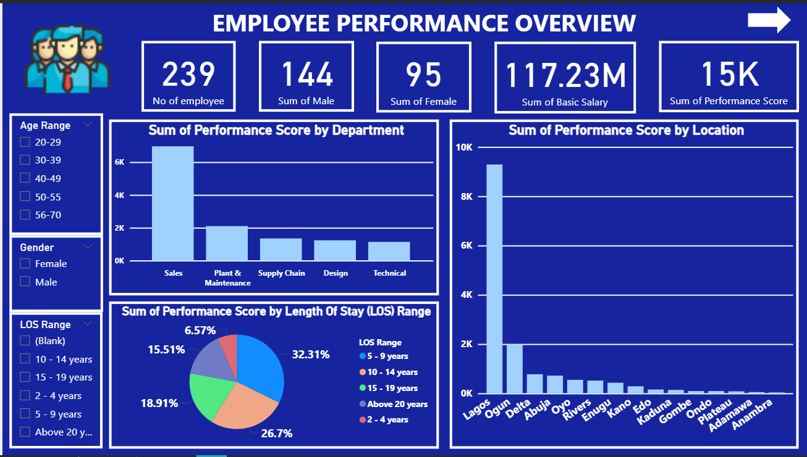
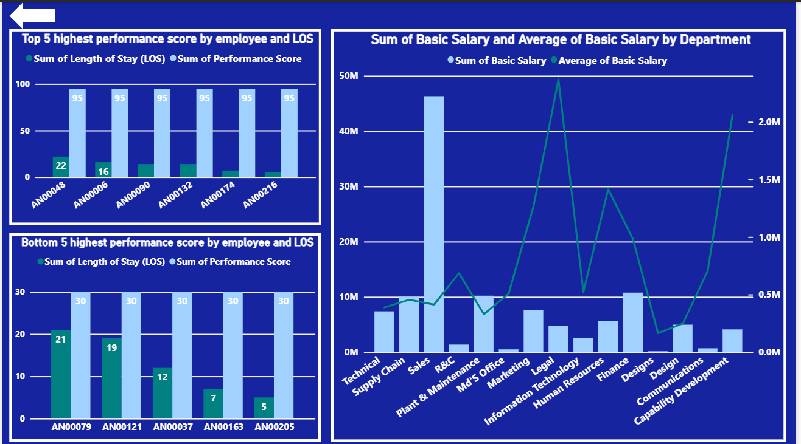

# Employee Performance Analysis – Interswitch Job Shadowing Program

## Introduction
This project examines employee performance information gathered through **Mr. Babatunde Akanbi's Interswitch Job Shadowing Program**. 
The objective was to use Power BI to find insights that could lead to more intelligent HR and business decisions.

## Problem Statement
Finding out which aspects of their workforce are performing well and where there are gaps is a challenge for many organizations. It becomes challenging to make wise HR and business decisions when there is a lack of clear insight into how performance is impacted by department, tenure, location, and salary.

The purpose of this project is to investigate workforce data to address important questions:
• What are the most and least productive departments?

• Do workers with longer tenure perform better?

• What effect does location have on worker performance?

• Do pay scales correspond to output?

• Where should HR concentrate its efforts on development or retention?

By revealing these insights, this analysis assists companies such as Interswitch in making data-driven choices that enhance employee performance, retention, and workforce strategy optimization.

## Objective
To evaluate employee performance across departments, locations, and tenure ranges and offer workable solutions to enhance employee outcomes and organizational efficacy.

## Dataset
• Source: Interswitch Group (via Job Shadowing Program)

• Nature: Workforce dataset covering departments, tenure, locations, salary, and performance ratings.

• Tools Used: Microsoft Power BI, Microsoft Excel

Note: Dataset name was not provided officially. For this project, it is referred to as **employee-performance-interswitch.**

## Key Findings
1. Sales is the performance engine. With over 6,000 points, sales leads in output, but it also has the highest base pay. Performance efficiency and incentive alignment can be evaluated.

2. Even though the top 5 performers had shorter lengths of stay (LOS), they all scored 95, proving that high performers aren't always long-timers. This implies that early-stage talent is producing excellent outcomes, and retention strategies ought to proactively target them.

3. Lagos is performing better than the others; the city accounts for more than 60% of the overall performance. Some states, such as Adamawa, Anambra, and Plateau, on the other hand, produce very little. This draws attention to regional disparities that might require assistance or strategic redistribution.

4. Salary and performance discrepancies in certain departments. Despite having low performance ratings, departments like Legal and Capability Development have high average salaries. This necessitates reviewing workforce capacity, KPIs, or role expectations.

5. Tenure sweet spot? Employees who have worked there for five to nine years have the highest performance share (32.3%), a possible "golden window" for productivity that should guide development and succession planning efforts.

## Recommendations
1. Retain New High Performers:
   Design tailored retention strategies for employees with high performance but short LOS.

2. Reevaluate Departmental ROI:
   Compare performance against salary to adjust KPIs and optimize resources.

3. Address Regional Gaps:
   Implement support plans in low-performing states to tackle gaps in leadership, tools, or talent availability.

4. Invest in Mid-Tenure Talent:
   Create development programs and leadership pipelines for employees within the 5–9 year range.

5. Leverage Sales Best Practices:
   Use the successful structure in Sales to improve onboarding, motivation, and performance across other teams.

##  Tools Used
• Power BI: Data cleaning, visualization, and dashboard creation

• Microsoft Excel: Data exploration

• GitHub: Project documentation

## DASHBOARDS CREATED

# About Me#
My name is **Sarat Alabi**, and I'm a data girl who loves telling stories with numbers. If there is data, I'm prepared to uncover the narrative it conveys, whether it concerns HR, business, or social impact.

## Connect with Me
• LinkedIn: https://www.linkedin.com/in/sarat-alabi/

• Email: saratalabi9@gmail.com

• GitHub: @AlabiSarat09

